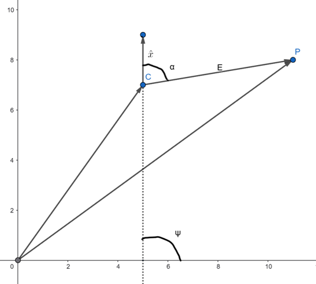
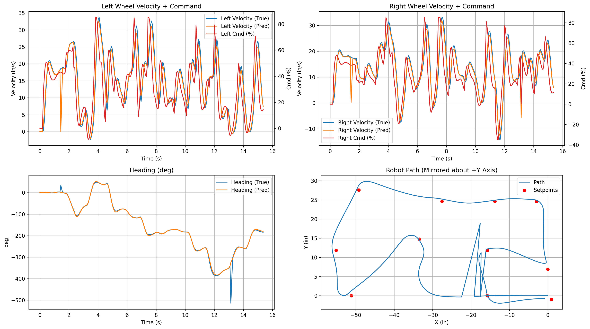
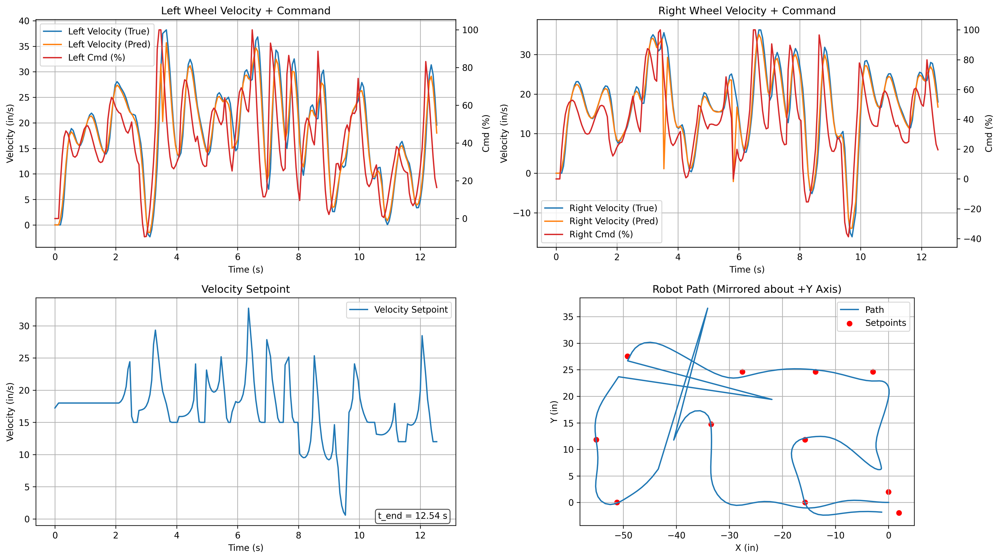
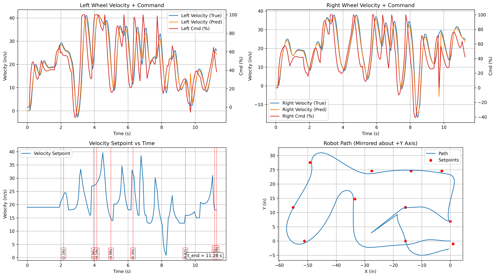
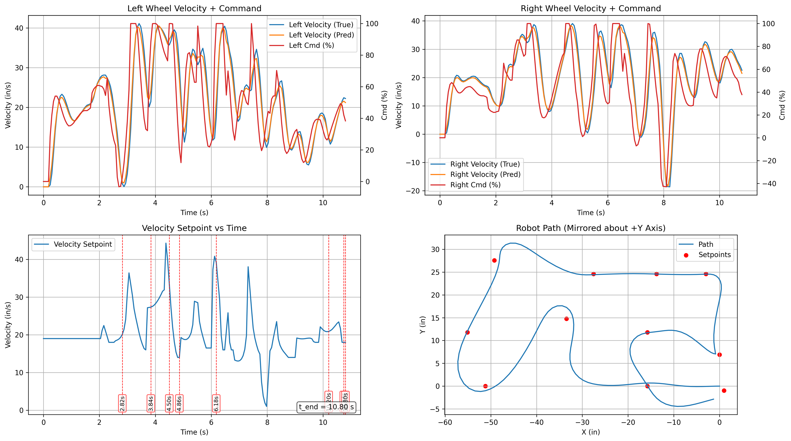

Heading and Speed Control Logic
===============================

Overview
---------------

This control algorithm is designed to orient and drive the Romi smoothly
and accurately along a predefined sequence of waypoints. At any given moment,
the controller uses three key pieces of information:

1. Romi’s current position :math:`\mathbf{C}` (X and Y position from state estimation)
2. The next target waypoint :math:`\mathbf{P}` (from a predefined list)
3. Romi’s absolute heading (yaw angle) :math:`\Psi` (from state estimation)

Using these, the algorithm computes the *error vector* pointing from Romi
to the next waypoint and then determines the angular misalignment between
Romi’s heading and this vector. This angle, or the *heading error*
:math:`\alpha`, is the primary quantity used for rotational control.

Heading Error Computation
--------------------------------  

This diagram illustrates the key vectors and angles involved in the heading error
calculation:

* Romi’s current position :math:`\mathbf{C}`
* The waypoint :math:`\mathbf{P}`
* The error vector :math:`\mathbf{E} = \mathbf{P} - \mathbf{C}`
* Romi’s heading vector :math:`\hat{\mathbf{h}}`
* The geometric angle :math:`\alpha` between the two vectors

To determine how far Romi must rotate to point toward the waypoint, the
algorithm computes the angle between Romi’s heading direction vector and the
error vector.

The heading direction (a unit vector) is given by:

.. math::

   \hat{\mathbf{h}} =
   \begin{bmatrix}
       \cos\Psi \\[4pt]
       \sin\Psi
   \end{bmatrix}

Using dot and cross products, the cosine and sine of the heading error
:math:`\alpha` are:

.. math::

   \cos\alpha = \frac{\hat{\mathbf{h}} \cdot \mathbf{E}}{\lVert \mathbf{E} \rVert}
   \qquad
   \sin\alpha = \frac{\hat{\mathbf{h}} \times \mathbf{E}}{\lVert \mathbf{E} \rVert}

The cross and dot products expand to:

.. math::

   \hat{\mathbf{h}} \times \mathbf{E}
   = \cos\Psi\,E_y \;-\; \sin\Psi\,E_x

.. math::

   \hat{\mathbf{h}} \cdot \mathbf{E}
   = (\cos\Psi)E_x \;+\; (\sin\Psi)E_y

Finally, the signed heading error is computed with:

.. math::

   \boxed{
   \alpha = \operatorname{atan2}\!\left(\hat{\mathbf{h}} \times \mathbf{E},
                                       \hat{\mathbf{h}} \cdot \mathbf{E}\right)
   }

.. note:: 
    We use :math:`\operatorname{atan2}` instead of :math:`\arccos` or
    :math:`\arcsin` because those functions cannot distinguish among all four
    quadrants; `atan2` preserves both magnitude and sign of the angular offset.

By iteratively updating the waypoint index once Romi gets within a
specified distance, the robot smoothly transitions from target to target along
its path. 

.. tip::
    Waypoints are spaced more closely in areas requiring high precision (e.g.,
    narrow corridors) to ensure accurate navigation.

Speed Control Logic
-------------------------

In addition to controlling heading, the algorithm modulates Romi’s linear
speed. Early testing showed that constant-speed operation produced undesirable
behavior: Romi would overshoot waypoints or miss them all together and try to backtrack,
especially during tight turns or when
approaching closely spaced points. To address this, the controller adjusts
speed based on two primary factors:

1. **Heading Accuracy** - 
   When :math:`\alpha` is large (i.e., Romi is not well aligned), forward speed
   is reduced so Romi turns rather than drifting off course. As alignment
   improves, speed increases.

2. **Distance to the Target** - 
   As Romi approaches a waypoint, speed is gradually reduced. This prevents
   overshooting and allows smoother transitions when the next waypoint becomes
   active.

The final commanded speed is computed as:

.. figure:: images/speed_law.svg
   :align: center
   :width: 100%

Here:

* ``FULLTHROTTLE``, ``SLOWDOWN_ON_APPROACH`` and ``head_weight``  
  are global tuning constants.
* ``base_speed_i`` and ``brake_dist_i``  
  vary by waypoint. Waypoints near walls use smaller base speeds, while
  waypoints prone to overshoot use larger brake distances.

This structure ensures Romi accelerates when appropriately aligned and far
from the target, yet decelerates for high heading error or when approaching a
waypoint. The ``max(…, 0)`` term guarantees speed is never penalized for being
too close to a target.

.. note::
    The speed-modulation logic was fine-tuned through empirical testing to
    balance responsiveness with stability. This alogrithm is likely overcomplicated
    but was left in its current form due to time constraints.

Performance Graphs
-------------------------

The following performance graphs were generated for full end-to-end runs of
Romi navigating the competition course. They capture detailed velocity behavior,
setpoint behavior and motor responses, along with the executed trajectory in the
world frame.

They were collected as the heading and speed controller parameters were fine-tuned
to optimize preformance and show the overall run time decreasing from about 16 seconds to 11 seconds.

At first, only observations about the overall path were used to guide tuning, but as
eventually velocity setpoint data was also analyzed to identify areas for improvement.

.. note::
    Some of the following graphs have large spikes. This is due to
    data being corrupted during Bluetooth transmission.

   Initial behavior shows higher variability, resulting in a longer overall runtime.

.. figure:: images/run2.png
   :align: center
   :width: 95%

   Improved alignment and smoother transitions reduce the overall runtime.

.. note::
    The vertical dashed lines in the velocity setpoint and trajectory plots
    indicate the approximate times Romi crossed each waypoint. These were
    inferred by matching Romi's X-position to the known waypoint locations.

   Early velocity profiles reflect inconsistent acceleration and turning, matching the longer runtime.

.. figure:: images/runvelo2.png
   :align: center
   :width: 95%

   Smoother wheel response supports the reduced runtime seen in the improved run.

   Further refinement leads to steadier velocities and cleaner waypoint approaches.

   Most stable velocity and trajectory behavior, corresponding to the shortest runtime.

Preformance Graph Analysis
~~~~~~~~~~~~~~~~~~~~~~~~~~~~~~

On the last few figures, the bottom-left graph shows the commanded linear velocity setpoint over time.
Key features to note include:

* **Plateaus in the velocity curve** occur as Romi approaches a waypoint.  
  These plateaus result from the **speed-bonus term dropping to zero** when the
  error distance :math:`\lVert \mathbf{E} \rVert` falls below the braking
  threshold. At this point Romi is no longer rewarded for good alignment and
  transitions into a controlled approach phase.

* Each **red dashed vertical line** indicates the approximate moment Romi passed
  a waypoint. Immediately following these moments, the **heading error jumps**
  because Romi begins targeting the *next* waypoint in the list. This sudden
  change in :math:`\alpha` causes the controller to temporarily reduce the
  commanded speed until alignment is recovered.

Taken together, these features demonstrate that the speed-control logic is
functioning as intended. Romi accelerates when it is well-aligned and decelerates
when approaching waypoints.

Comparison to Pure Pursuit
----------------------------------------------------------

The heading based waypoint controller with linear velocity speed-modulation
represent a novel approach to path tracking. A more standard approach is to use
a Pure Pursuit controller, which continuously tracks a lookahead point along
a reference path.

This section provides a brief comparison between the two methods.

Heading-Based Waypoint Controller
~~~~~~~~~~~~~~~~~~~~~~~~~~~~~~~~~~~

**Pros**

* Simple - requires only current pose, next waypoint, and
  heading angle.
* Potentially less computationally intensive, as it does not require
  path interpolation or lookahead point calculation.
* Well suited for discrete, task-driven waypoint sequences (e.g., hitting objects
  or avoiding obstacles).
* Provides intuitive control over speed near critical regions;
  the speed law clearly modulates velocity based on heading error and proximity.

**Cons**

* Heading error exhibits discontinuities at waypoint switches, as seen in the
  plots where :math:`\alpha` jumps and velocity plateaus form.
* Path smoothness is not guaranteed; transitions between
  waypoints can cause the controller to call for dramatic rotational acceleration.
* Performance depends strongly on waypoint placement, as the controller does not
  consider a continuous reference path.

Pure Pursuit Controller
~~~~~~~~~~~~~~~~~~~~~~~~~~~

**Pros**

* Produces smoother geometric paths by following a continuous curve with a
  sliding lookahead point.
* Reduces discontinuities at transitions - leading to smoother wheel
  velocities profiles.
* Offers more predictable path behavior.

**Cons**

* Less naturally aligned with discrete task-centric waypoints, may require
  additional logic to ensure precise stopping or alignment at specific points.
* More computationally intensive due to path interpolation and lookahead calculations.
* Potentially requires more RAM to store many path points depending on the path complexity.

Summary
-------------------------

For this project, the heading-based controller offered a practical and reliable
solution, as reflected in the progressively decreasing runtimes observed in testing.
With additional tuning and refinement,
this approach could be further optimized for even better performance.

