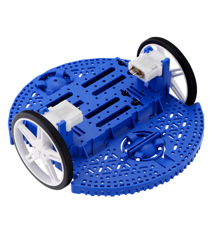
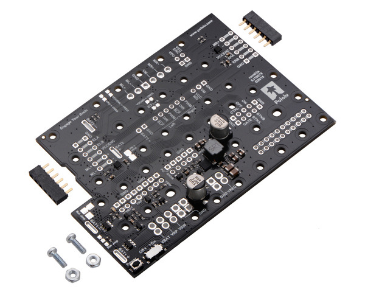
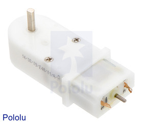
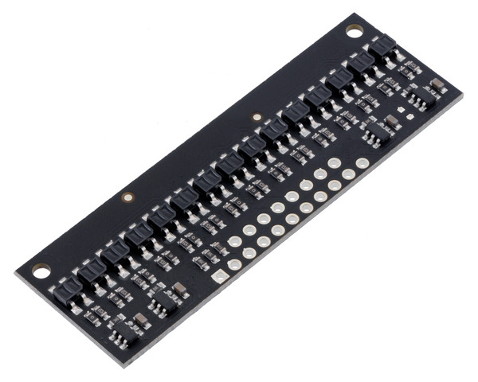
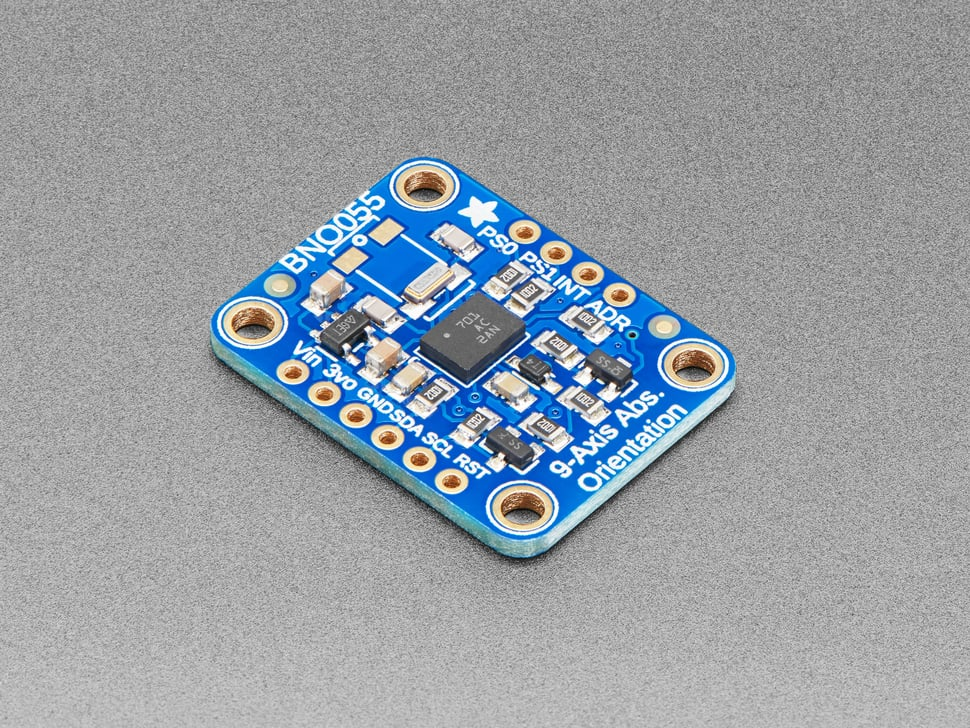

Hardware Overview
=================

This section describes the hardware components used in the Romi robot
platform developed for this project. The system integrates an STM32-based
microcontroller, a custom interface board, multiple Pololu-provided
modules, and a variety of sensors that enable closed-loop autonomous
operation.

STM32 Nucleo-64 (L476RG)
------------------------

`Product page <https://www.st.com/en/evaluation-tools/nucleo-l476rg.html>`_

.. image:: images/nucleo.webp
   :alt: STM32 Nucleo-64 L476RG board
   :width: 400px
   :align: center

The STM32 Nucleo-64 serves as the primary MCU for the robot. It is powered
by an ARM® 32-bit Cortex®-M4 CPU operating up to **80 MHz**. For this project,
communication with the Nucleo was achieved through the *Shoe of Brian* board
instead of the on-board ST-Link interface.

Relevant on-chip peripherals include:

- **I²C** (Used to interface with the IMU)
- **UART** (Used to interface with the Bluetooth modile)  
- **GPIO** (Used for motor control, status LEDS, and bump sensing)
- **ADC (16-channel)** (Used for reflectance sensor array sampling) 

.. toctree::
   :maxdepth: 1

   stm32-pins

Shoe of Brian Interface Board
-----------------------------

`Documentation <https://spluttflob.github.io/ME405-Support/shoe_info.html>`_

.. image:: images/shoeofbrian
   :alt: Shoe of Brian communication board
   :width: 350px
   :align: center

Developed by **Dr. John Ridgely** (Cal Poly), the Shoe of Brian attaches
directly to the Nucleo-64 and provides a reliable programming/debugging
interface for MicroPython.

- Mini-USB interface for **REPL** and **filesystem** access  
- Power routing and additional convenience wiring  

This board greatly simplifies program upload and debugging during
development.

Romi Chassis Kit
----------------

`Product page <https://www.pololu.com/category/203/romi-chassis-kits>`_

The **Pololu Romi chassis** provides the mechanical structure and drivetrain for
the robot. This low-cost, modular platform includes:

- Injection-molded chassis  
- Differential-drive motors  
- 70 mm wheels  
- Battery housing for **6x AA cells**  
- Numerous mounting points for sensors and electronics  

Its standardized mounting pattern ensures compatibility with other Pololu
hardware, including the encoders and power distribution board used here.

Romi Power Distribution Board (PDB)
-----------------------------------

`Product page <https://www.pololu.com/product/3543>`_

The Romi PDB integrates:

- **Two DRV8838 motor drivers**  
- A **step-down regulator** to power the Nucleo  
- Breakouts and headers for motor/encoder connections  

The motor drivers support multiple control methods.
For this project, they were configured to use

- **Enable/disable** pins  
- **Motor Direction** pins 
- **Unsigned PWM** for motor effort  

The PDB mounts directly onto the chassis and provides clean electrical
integration between motors, encoders, and control electronics.

Romi Motors
-----------

`Product page <https://www.pololu.com/product/1520>`_

The Romi motors are brushed DC gearmotors with:

- Plastic gearboxes  
- 120:1 reduction  
- Extended rear motor shafts for encoder attachment  

These motors provide enough torque and speed for the obstacle-course tasks
in this project while remaining lightweight and inexpensive.

Romi Quadrature Encoders
------------------------

`Product page <https://www.pololu.com/product/3542>`_

.. image:: images/romiencoder.jpg
   :alt: Pololu Romi quadrature encoders
   :width: 400px
   :align: center

Each encoder module attaches directly to the motor's rear shaft and uses:

- **Two Hall-effect sensors**  
- A **6-pole magnetic disk**

This produces **approximately 1440 ticks per wheel revolution**, enabling:

- Wheel velocity estimation  
- Quadrature decoding via the MCU's timer encoder interface  

Reflectance (Line) Sensor Array
-------------------------------

`Product page <https://www.pololu.com/product/4215/resources>`_

The line sensor array consists of **15 IR LED/phototransistor pairs**, each
producing an analog voltage proportional to reflected IR intensity.
Characteristics:

- LEDs can be driven at variable brightness  
- Odd and even LEDs can be toggled independently  
- Each channel is read by the STM32's ADC
- Used for detecting the black line on the course and computing a centroid
  for steering control

This sensor was mounted to the underside of the chassis.

:note::
    For this project, only the center 13 channels were used 
    since some of the STM32's ADC channels correspond to pins
    which were used for other purposes

IMU (BNO055)
------------

`Product page <https://www.adafruit.com/product/2472>`_

The **BNO055** is a 9-DOF inertial measurement unit combining:

- 3-axis accelerometer  
- 3-axis gyroscope  
- 3-axis magnetometer  

It performs **on-board sensor fusion**, providing high-level metrics such as:

- Orientation (Euler angles)  
- Angular velocity  
- Linear acceleration  

Communication occurs over **I²C**.

.. note::
   The BNO055 requires calibration for accurate measurements. Calibration
   data was stored on program exit and loaded on program startup.
