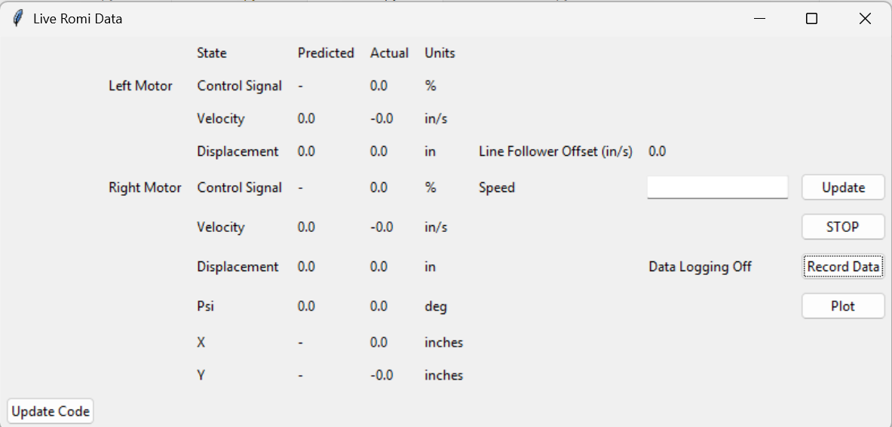
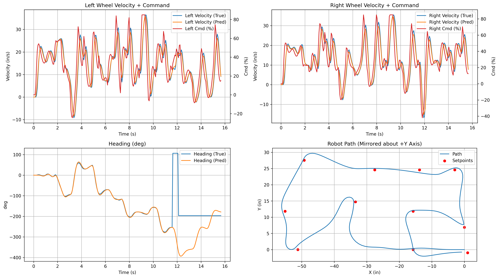
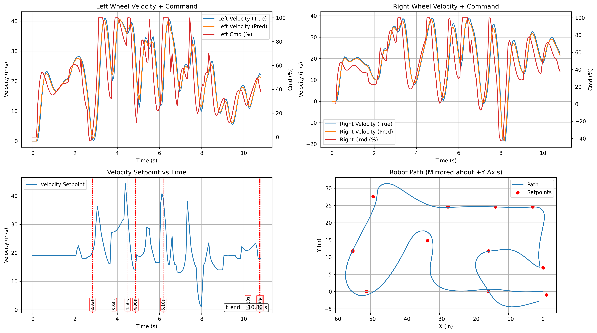

PC User Interface
==============================

Overview
--------

The scripts ``Talker.py``, ``RomiDisplay.py``, and ``GoatedPlotter.py``
form a comprehensive **PC-side user interface** for interacting with the
Romi robot over a Bluetooth serial connection.

This interface uses **multiple threads** to handle real-time data
streaming, user input, and data analysis concurrently.

It consists of four primary components:

* A **serial RX thread** that continously reads and decodes telemetry
  packets from the robot, using a predefined binary packet format
  (:mod:`Talker`).
* A **serial TX thread** that sends control commands to the robot
  (:mod:`Talker`).
* A **Tkinter GUI** for real–time data monitioring and control of the robot
  (:mod:`RomiDisplay`). 
* A **data–analysis and plotting engine** triggered automatically after
  each data-logged run (:mod:`GoatedPlotter`).

Together these scripts let the user:

* Stream high-rate telemetry from the robot over a Bluetooth virtual COM
  port.
* Visualise predicted vs. actual wheel motion and robot pose in real
  time.
* Log experiments and automatically generate plots and CSV exports.

Component Details
-----------------

Main application: ``Talker.py``
~~~~~~~~~~~~~~~~~~~~~~~~~~~~~~~

This main script orchestrates the PC side of the telemetry system.

Serial Configuration
^^^^^^^^^^^^^^^^^^^^

* Opens the Bluetooth COM port:

  .. code-block:: python

     ser = serial.Serial('COM13', 460800, timeout=1)

* Uses a shared ``serial_lock`` (a :class:`threading.Lock`) to ensure
  safe concurrent access from reader and writer threads.

.. warning::
    ``'COM13'`` must match the host system's Bluetooth serial port.
    Additionally, the baud rate must match the Bluetooth module's configuration.

Telemetry Reader Thread
^^^^^^^^^^^^^^^^^^^^^^^

The ``SerialReader`` function runs in its own daemon thread and is
responsible for decoding the robot's binary telemetry stream.

* **Framing**

  * Packets are framed with a two–byte sync word and a type byte:

    - Sync: ``0xAA 0x55``
    - Type: one byte just after the sync:

      * ``0x00`` – standard telemetry packet.
      * ``0xFF`` – handshake or special information.
    
    .. tip::
        The handshake packet type is currently not implemented.

  * ``SerialReader`` maintains a rolling ``bytearray`` buffer:

    - Searches for the sync sequence.
    - Discards preceding bytes if sync is not aligned.
    - Verifies that enough bytes are present for a full packet before
      attempting to unpack.

* **Payload format**

.. warning::
    The general packet format as well as the order and
    types of specific fields must exactly match the
    robot-side :func:`Talker_fun` implementation.

  * Telemetry payload is defined by:

    .. code-block:: python

       format = '<IIfffffffffffffffff'
       packet_length = struct.calcsize(format) + 3

  * This corresponds to:

    - 2× unsigned 32-bit integers (``I``)
    - 17× 32-bit floats (``f``)
    - Plus 3 bytes for sync and type.

  * The data fields are unpacked in order and distributed to queues:

    ==========  ===============================
    Index       Meaning
    ==========  ===============================
    0           ``time_L`` (uint32)
    1           ``time_R`` (uint32)
    2           ``pos_L`` (actual left wheel path)
    3           ``velo_L`` (actual left velocity)
    4           ``velo_R`` (actual right velocity)
    5           ``pos_R`` (actual right wheel path)
    6           ``cmd_L`` (commanded left % duty cycle)
    7           ``cmd_R`` (commanded right % duty cycle)
    8           ``Eul_head`` (actual Euler heading)
    9           ``yaw_rate`` (actual yaw rate)
    10          ``offset`` (line–follower offset)
    11          ``X_pos``
    12          ``Y_pos``
    13          ``p_v_R`` (predicted right velocity)
    14          ``p_v_L`` (predicted left velocity)
    15          ``p_head`` (predicted heading)
    16          ``velo_set`` (commanded speed)
    17          ``p_pos_L`` (predicted left position)
    18          ``p_pos_R`` (predicted right position)
    ==========  ===============================

.. warning::
    The yaw rate is currently not read from the IMU so its field
    is used to transmit the velocity setpoint. This chnage is not well-documented
    and is recongized in
    the plotting engine (:mod:`GoatedPlotter`) but not the GUI display
    (:mod:`RomiDisplay`).

* **Thread coordination**

  * Respects a global event ``read_stop``:

    - If set, the reader temporarily sleeps and skips serial I/O.
    - Used during firmware update so that the serial port is not actively read.

* **Data logging**

  * When the ``record_data`` event is set by the user, each decoded sample is also
    appended to a shared ``recorded_data`` dictionary of lists keyed by
    the field names above.

Serial Writer Thread
^^^^^^^^^^^^^^^^^^^^

The ``SerialWriter`` function runs in a second daemon thread and is
responsible for sending commands to the robot.

* Watches a :class:`queue.Queue` named ``Ser_cmds``.
* When a command string is available, it:

  - Acquires ``serial_lock``.
  - Writes the command followed by ``"\\r\\n"`` to the serial port.
  - Calls ``ser.flush()`` to make sure the command is sent immediately.

* Respects the ``write_stop`` event in the same way that the reader
  respects ``read_stop`` (for firmware update operations).

  

Tkinter GUI: ``RomiDisplay``
~~~~~~~~~~~~~~~~~~~~~~~~~~~~

:class:`RomiDisplay` is the main user–facing interface for monitoring
and operating the robot.

   Tkinter GUI for real-time Romi telemetry display and control.

Layout and displayed telemetry
^^^^^^^^^^^^^^^^^^^^^^^^^^^^^^

The **“Live Romi Data”** window shows a unified table with the columns
*State*, *Predicted*, *Actual*, and *Units*.

* **Left/Right Motor**

  - *Control Signal* row: displays the actual duty cycle in percent.
  - *Velocity* row: predicted vs. actual wheel velocity (in/s).
  - *Displacement* row: predicted vs. actual wheel displacement (in).

* **Pose**

  - *Psi* row: predicted heading ``p_head`` vs. estimated heading
    ``Eul_head`` (deg).
  - *X* and *Y* rows: current position in inches
  .. note::
      The X and Y positions displayed are the predicted values.
      Romi's doesn't know its true position.

* **Auxiliary readouts**

  - A label on the right shows **Line Follower Offset (in/s)** and its
    current value.

.. warning::
    The yaw rate is currently not read from the IMU so its field
    is used to transmit the velocity setpoint. This means that the GUI 
    displays the velocity setpoint in place of the yaw rate.

All displayed values are backed by :class:`queue.Queue` instances
created in ``Talker.py`` and passed into :class:`RomiDisplay`. The GUI
calls ``update_display()`` every 5 ms to:

* Drain each queue if new data are present.
* Round numeric values to two decimal places.
* Convert radians to degrees for heading fields.

Control widgets
^^^^^^^^^^^^^^^

.. warning::
    The GUI controls are designed for developer use and
    are not robust. For examples, hitting **"Plot"** (or
    **"STOP"** when data logging is enabled) without
    any recorded data can cause the plottng thread to
    raise an exception and crash.
    Additionally, the frimware sequence triggered by the
    **"Update Code"** button is blocking and will freeze
    the GUI window until it completes.

The GUI also provides several controls:

* **Speed control**

  - Speed entry field labelled **Speed**.
  - **“Update”** button:

    * Optionally starts data recording (if data logging is enabled).
    * Puts the command string ``"$SPD<value>"`` into ``Ser_cmds``.

  - **“STOP”** button:

    * Sends ``"$SPD0"`` to the robot.
    * If data logging is enabled, triggers the plotting engine :mod:(`GoatedPlotter`).

* **Recording control**

  - A status label to the right of the table shows *“Data Logging On”*
    or *“Data Logging Off”*.
  - **“Record Data”** toggle button (``toggle_record``):

    * When turned on:

      - Sets ``record_enable``.
      - Clears all lists in the shared ``recorded_data`` dictionary.
      - Updates the status label.

    * When turned off:

      - Clears ``record_enable`` and updates only the status label.

  - Sample-by-sample logging is controlled by the ``record_data`` event;
    :meth:`RomiDisplay.speed` starts logging for a run and
    :meth:`start_plotter` stops it.

* **Plotting**

  - **“Plot”** button calls :meth:`start_plotter`, which:

    - Clears ``record_data`` (stops logging).
    - Sets the ``go_plot`` event so :mod:`GoatedPlotter` can:

      * Consume ``recorded_data`` and
      * Generate plots and CSV exports.

* **Firmware update**

  - Bottom-left **“Update Code”** button calls :meth:`update`:

    * Uses ``read_stop`` and ``write_stop`` to pause serial I/O.
    * Runs an ``mpremote`` command such as::

         mpremote connect COM9 cp -r ./src/. :

      to copy MicroPython source files from ``./src/`` to the robot.
    * Restarts a PuTTY session using the preconfigured *“Default
      Settings”* profile for interactive debugging.

.. note::
    The COM port in the ``mpremote`` command must match the Romi's
    USB serial port accessed through the Shoe of Brian.

.. note::
    If a PuTTY session is already open, pressing **“Update Code”**
    will cause the mpremote command to fail since the serial port
    is already in use. Make sure to close any existing PuTTY windows
    before updating.

.. tip::
    When a PuTTY session is launched by the **“Update Code”** button,
    the script reatains the process handle. It will try to kill the process
    the next time the button is pressed. So, you don't need to worry about
    closing PuTTY windows opened by the script before hitting the button again.

Plotting Engine: ``GoatedPlotter.py``
~~~~~~~~~~~~~~~~~~~~~~~~~~~~~~~~~~~~~

The :func:`GoatedPlotter` function is a data-analysis and plotting engine
that
runs asynchronously in its own loop and is activated by the main GUI.

.. note::
    The :func:`GoatedPlotter` function used :mod:`matplotlib` for plotting
    which uses :mod:`Tkinter` as its default backend. Since a Tkinter
    window is already open for the main GUI, the
    plotting thread will throw warnings when ever it opens a plot window.
    These can be safely ignored.

State machine
^^^^^^^^^^^^^

The function cycles between two states:

* **State 0 – idle:**  
  Waits until ``go_plot.is_set()`` becomes true.

* **State 1 – process & plot:**  
  Executes the entire data-analysis pipeline:
  - Input validation
  - Outlier cleaning
  - CSV export
  - Plot generation
  - Output image saving
  - Clearing data and returning to idle

Outlier cleaning
^^^^^^^^^^^^^^^^

A helper function :func:`clean_outliers` implements a **median absolute
deviation (MAD) filter**, replacing samples that deviate more than
``threshold × MAD`` with the average of their immediate neighbors.

.. note::
    The MAD filter is necessary becuase data corrupted during bluetooth
    transmission regularly produces very large or small values when the binary
    packet is decoded. These outliers would lead to illegible plots before this 
    filter was implemented.

CSV export
^^^^^^^^^^

At the beginning of state 1:

* A timestamped CSV file is created inside ``./test_data``.
* All data streams are saved as columns.
* Not all data streams are plotted, but **all** fields are still
  exported for offline research.

Timestamp normalization
^^^^^^^^^^^^^^^^^^^^^^^

Both ``time_L`` and ``time_R`` are converted from milliseconds to
seconds, and normalized so the first entry begins at ``t=0``.

.. note::
    Due to the controller configuration, there is very little difference
    between these data sets and for simplicity only ``time_L`` is used for
    plotting graphs that don't contain to wheel-specific data (eg, Heading).

Plot creation (2×2 grid)
^^^^^^^^^^^^^^^^^^^^^^^^

A figure is created which contains four subplots:

1. **Left Wheel Velocity + Command**
   - True vs. predicted velocity  
   - Command duty (%) on a twin y-axis

2. **Right Wheel Velocity + Command**
   - Same layout as the left wheel

3. **Velocity Setpoint vs Time with Checkpoints**
   - Setpoint trace over time
   - Vertical dashed lines marking inferred checkpoint times  
     (determined by matching X-position to path setpoints)
   - A textbox labeling the end time of the run

.. note::
    An earlier version of this scripts contained a subplot for heading
    vs. time, contianing both true and predicted values.

4. **XY Path with Reference Setpoints**
   - Actual trajectory (X,Y), mirrored across the +Y axis for plot
     convention
   - Red dots indicating path setpoints  
   - Equal axis scaling for geometric accuracy

Checkpoint detection
^^^^^^^^^^^^^^^^^^^^

The plotting script automatically derives the moment the robot reaches
each path setpoint:

* Iterates through target ``X_SP`` values.
* Finds the nearest future sample in measured ``X_pos``.
* Stores those times for annotation on the velocity-setpoint subplot.

This gives experimenters **automatic segmentation of runs** without
manual timestamp labeling.

.. warning::
    This function is experimental and can sometimes produce
    erronous results, espcially is Romi does not complete a complete run.

Saving outputs
^^^^^^^^^^^^^^

Two persistent artifacts are saved:

* **CSV file** in ``test_data/romi_data_<timestamp>.csv``
* **PNG figure** in ``plots/<timestamp>.png``

Example plots
^^^^^^^^^^^^^^^ 

.. tip::
    Click on each image to view a larger version.

The following images show example outputs from different logged runs.
Over time, the plotting script was modified to present different outputs,
depending on what functionality was being developed.

.. figure:: images/ActualCircle.png
   :alt: Initial circular path plots with displacement and heading
   :align: center
   :width: 90%

   Early version of the plotting engine showing six subplots: left/right
   wheel velocity and command, integrated displacement, heading, and robot path.  

   Intermediate version that removes the displacement subplots and
   focuses on left/right velocity tracking, heading, and the robot path
   mirrored about the +Y axis to align with the obstacle course layout.
   Reference path setpoints are overlaid as
   red markers.

   Current plotting engine output: left/right velocity tracking as
   before, plus a dedicated “Velocity Setpoint vs Time” panel with
   vertical lines and labels at automatically detected checkpoints.

Threading and Synchronisation
~~~~~~~~~~~~~~~~~~~~~~~~~~~~~~~~

The system uses standard :mod:`threading` primitives for coordination
between the GUI and background workers.

Events
^^^^^^^^^^^

* ``record_data``

  - When set: :func:`SerialReader` logs each sample into
    ``recorded_data``.
  - When cleared: incoming data is still displayed live, but not written
    to the log.

* ``read_stop`` and ``write_stop``

  - When set: suspend serial reads / writes, respectively.
  - Used by :meth:`RomiDisplay.update` to safely perform firmware
    updates without racing the I/O threads.

* ``go_plot``

  - When set: plotting thread (``GoatedPlotter``) should generate
    plots from the current snapshot of ``recorded_data``.
  - Cleared before starting a new logging run.

Queues
^^^^^^^^^^^^^^

Each telemetry field has its own :class:`queue.Queue`, ensuring
thread–safe communication from ``SerialReader`` to :class:`RomiDisplay`.

Commands from the GUI to the serial writer are funneled through the
``Ser_cmds`` queue.

Usage Guide
-----------

Prerequisites
~~~~~~~~~~~~~

* Robot firmware using :class:`BTComm` and :func:`Talker_fun` to send/recieve telemetry
  packets over Bluetooth.
* PC with:

  - Python 3+
  - ``pyserial``, ``numpy``, ``matplotlib``, ``tkinter``
  - ``mpremote`` on PATH (for Romi firmware updates).
  - PuTTY installed (with a *“Default Settings”* profile
    configured for the Romi's USB serial port).

Running the host
~~~~~~~~~~~~~~~~

.. warning::
    Sometimes the Bluetooth module will silently disconnect from the PC.
    You can tell this happens when telemetry is not updating in the GUI.
    Even though the code on Romi is active. If this happens,
    completing the following steps in this order.

    1. Stop the host script ``Talker.py`` (Ctrl+C in terminal).
    2. Power cycle the Romi robot.
    3. Wait for the Bluetooth module to pair with the PC. (This looks like the
       module's blue LED turning off.)
    4. Restart the host script.

1. Pair the Bluetooth module with the host PC and determine the virtual COM port.
   This link has useful information regarding pair the HC-05 Bluetooth module with
   windows PCs: 
2. Update the Bluetooth and USB serial port strings in ``Talker.py`` if different from
   ``'COM13'`` and ``'COM9'``, respectively.
3. Start the host script:

   .. code-block:: bash

      python Talker.py

4. You should see:

   * A console message like ``"Connected to COM13"``.
   * The Tkinter window **“Live Romi Data”**.

5. Use the GUI to:

   * Enter a speed and press **“Update”** to start motion and,
     optionally, logging.
   * Press **“STOP”** to halt the robot; if logging is enabled, the
     plotting thread will be triggered.
   * Toggle **“Record Data”** to control whether runs are logged.
   * Press **“Plot”** to manually trigger plotting of the current
     dataset.

Firmware update workflow
~~~~~~~~~~~~~~~~~~~~~~~~

.. note::
    Ensure that any existing PuTTY sessions connected to Romi
    are closed before starting this process, unless these sessions
    were opened by the **“Update Code”** button itself.
    Otherwise, **“Update Code”** will fail quietly.

1. Press the **“Update Code”** button in the GUI.

   * Serial I/O threads pause using ``read_stop`` and ``write_stop``.
   * ``mpremote`` copies the contents of ``./src/`` to the robot.

2. A PuTTY session is launched using the *“Default Settings”* profile to
   interact with the robot's REPL.

3. Once update is complete, the serial reader/writer threads resume.

