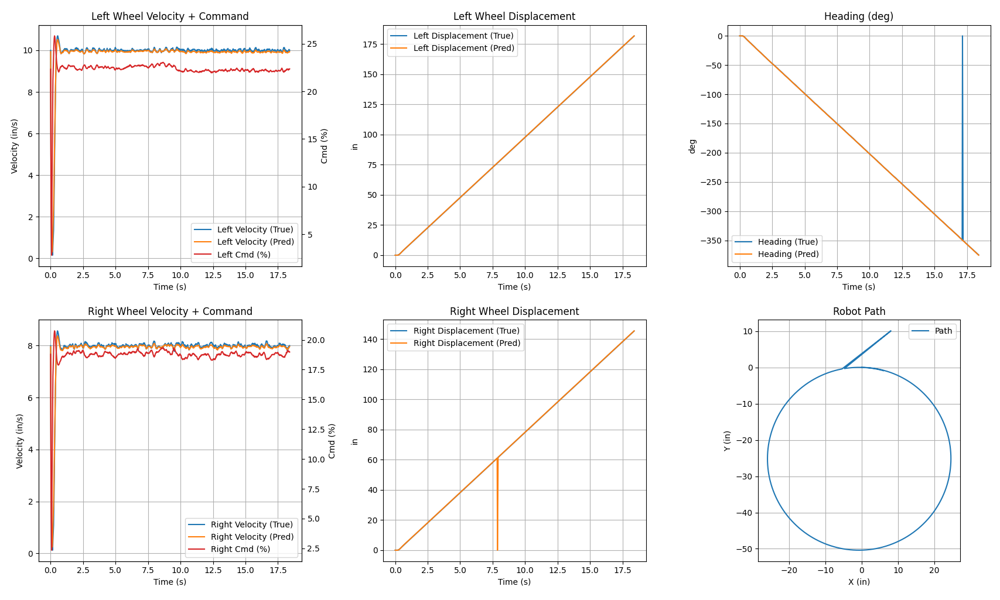
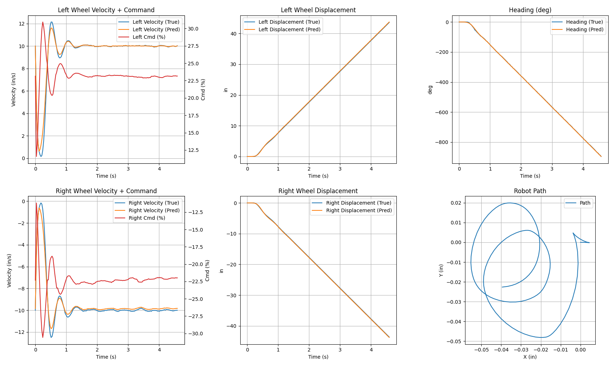
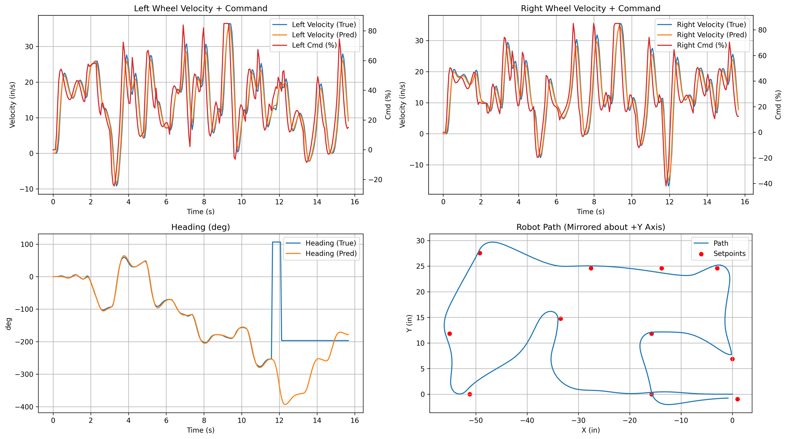
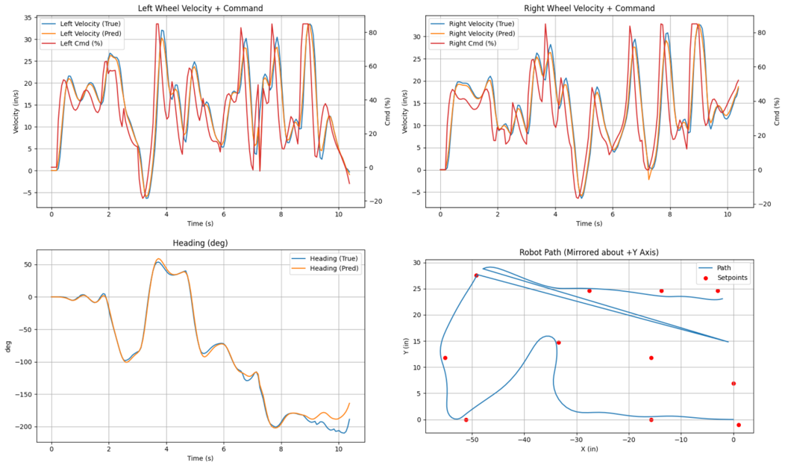

State Space Model
=========================

This page describes the state-space model and observer used for
the Romi differential-drive robot.

It covers:

* The plant and observer equations that are implemented in the
  :class:`~me405.SSModel.SSModel` class.
* Measures taken to enable the model to be run in real-time on the
  STM32.
* Results and performance of the observer in practice.

State-Space Model and Observer Equations
------------------------------------------

.. note::
    For simplicty, the output of the observer is simply all of its states.
    So, :math:`\hat{y} = \hat{x}`.

State Vector
~~~~~~~~~~~~~~~~~~
The observer maintains estimates of velocity, heading, wheel displacement,
and global position as a 7-dimensional state vector:

.. math::

   \hat{x} =
   \begin{bmatrix}
   \hat{v}_L \\
   \hat{v}_R \\
   \hat{\psi} \\
   \hat{s}_L \\
   \hat{s}_R \\
   \hat{X} \\
   \hat{Y}
   \end{bmatrix}

where

* :math:`\hat{v}_L` – estimated left wheel linear velocity (in/s)
* :math:`\hat{v}_R` – estimated right wheel linear velocity (in/s)
* :math:`\hat{\psi}` – estimated robot heading (rad)
* :math:`\hat{s}_L` – estimated left wheel linear displacement (in)
* :math:`\hat{s}_R` – estimated right wheel linear displacement (in)
* :math:`\hat{X}` – estimated global :math:`x` position in the world frame (in)
* :math:`\hat{Y}` – estimated global :math:`y` position in the world frame (in)

Inputs and Measurements
~~~~~~~~~~~~~~~~~~~~~~~~
**Inputs (control):**

.. math::

   u =
   \begin{bmatrix}
   u_L \\
   u_R
   \end{bmatrix}

* :math:`u_L, u_R` – left/right motor control inputs. That is scaled voltage commands
scaled based on commanded duty cycle.

**Measurements (sensors):**

.. math::

   y =
   \begin{bmatrix}
   \psi_{\text{IMU}} \\
   v_{L,\text{ENC}} \\
   v_{R,\text{ENC}} \\
   s_{L,\text{ENC}} \\
   s_{R,\text{ENC}}
   \end{bmatrix}

* :math:`\psi_{\text{IMU}}` – heading from IMU (rad, unwrapped)
* :math:`v_{L,\text{ENC}}, v_{R,\text{ENC}}` – left/right wheel linear velocity from encoders (in/s)
* :math:`s_{L,\text{ENC}}, s_{R,\text{ENC}}` – left/right wheel linear displacement from encoders (in)

Original Plant Model
~~~~~~~~~~~~~~~~~~~~~~~~

The continuous-time plant model (no observer feedback) describes the predicted
robot dynamics using a first-order motor model.

Parameters
^^^^^^^^^^^^^

* :math:`r` – wheel radius (in)
* :math:`w` – wheel base / track width (in)
* :math:`K_m` – motor gain (rad/(V·s))
* :math:`\tau_L, \tau_R` – left/right motor time constants (s)

State Equations
^^^^^^^^^^^^^^^^^
Using linear wheel velocities :math:`v_L, v_R` (in/s) and displacements :math:`s_L, s_R` (in):

.. math::

   \dot{v}_L &= \frac{1}{\tau_L} \left( r K_m u_L - v_L \right) \\[4pt]
   \dot{v}_R &= \frac{1}{\tau_R} \left( r K_m u_R - v_R \right) \\[4pt]
   \dot{\psi} &= \frac{1}{w} \left( v_R - v_L \right) \\[4pt]
   \dot{s}_L &= v_L \\[4pt]
   \dot{s}_R &= v_R \\[4pt]
   \dot{X} &= \frac{1}{2} \left( v_R + v_L \right) \cos(\psi) \\[4pt]
   \dot{Y} &= \frac{1}{2} \left( v_R + v_L \right) \sin(\psi)

Augmented Observer Model
~~~~~~~~~~~~~~~~~~~~~~~~~~~~

The observer uses the same plant model plus feedback terms that pull the
estimated states toward sensor measurements.

Observer Gains
^^^^^^^^^^^^^^^^^^

* :math:`L_{vL}, L_{vR}` – wheel velocity gains
* :math:`L_{\psi}` – heading gain
* :math:`L_{sL}, L_{sR}` – wheel displacement gains

Observer State Equations
^^^^^^^^^^^^^^^^^^^^^^^^^^

The observer produces estimated states :math:`\hat{x}` and 
outputs :math:`\hat{y}`:

.. math::

   \dot{\hat{v}}_L &= \frac{1}{\tau_L}\left( rK_m u_L - \hat{v}_L \right)
                     + L_{vL}\left( v_{L,\text{ENC}} - \hat{v}_L \right) \\[6pt]
   \dot{\hat{v}}_R &= \frac{1}{\tau_R}\left( rK_m u_R - \hat{v}_R \right)
                     + L_{vR}\left( v_{R,\text{ENC}} - \hat{v}_R \right) \\[6pt]
   \dot{\hat{\psi}} &= \frac{1}{w}\left( \hat{v}_R - \hat{v}_L \right)
                      + L_{\psi}\left( \psi_{\text{IMU}} - \hat{\psi} \right) \\[6pt]
   \dot{\hat{s}}_L &= \hat{v}_L
                     + L_{sL}\left( s_{L,\text{ENC}} - \hat{s}_L \right) \\[6pt]
   \dot{\hat{s}}_R &= \hat{v}_R
                     + L_{sR}\left( s_{R,\text{ENC}} - \hat{s}_R \right) \\[6pt]
   \dot{\hat{X}}   &= \frac{1}{2}\left( \hat{v}_R + \hat{v}_L \right)\cos(\hat{\psi}) \\[6pt]
   \dot{\hat{Y}}   &= \frac{1}{2}\left( \hat{v}_R + \hat{v}_L \right)\sin(\hat{\psi})

These equations combine correct the predicted plant dynamics based  
on the deviation of the predicted states from observed values.

.. note:: 
    The global position states :math:`\hat{X}, \hat{Y}` are hard to directly
    measured, especially because they represent the position of Romi's center of gravity.
    And that's just when Romi's at a stand still. In real time, we have no way of measuring
    Romi's absolute position. In other words the position states are **not observable**.
    So instead we feedback on the observable states,
    wheel velocities and heading, in the hopes of accurately predicting position.

Real-Time Implementation
-------------------------

To run the observer in real-time on the STM32 microcontroller, 
the state equations were left in scalar form rather than following 
the more compact matrix representation typically used in state-space
models.
Then, a 4th-order Runge-Kutta (RK4) integrator) was implemented
to preform fixed-step numerical integration of the state equations at each
control loop iteration. 

The RK4 integrator requires that 2 assumptions be made:
1. The time step :math:`\Delta t` is sufficiently small for the RK4 approximation to be accurate.
2. The time step :math:`\Delta t` is constant.

(There are other assumptions inherent to RK4, but these are the most relevant here.)

Using the prioritized scheduler, the state estimator task was optimized to run
as quickly as possible, and with as little heap allocation as possible.

.. Note::
    The MCU used in this project has a very small amount of RAM,
    so running out of heap memory is a real concern. When heap memory
    is depleted, the intrepreter automatically triggers garbage collection,
    but this takes a significant amount of time and disrupts real-time
    performance. In this case, it would cause scheduling delays that would
    violate the second RK4 assumption above.

It was dicovered that the key to making sure that the state estimator ran 
on time and was to ensure that the garbage collector task :func:`~me405.gc_task`
was able to run at its scheduled frequency, or once every "main loop."

.. Note::
    The final scheduler design had nearly all taks running at the same
    frequency (once per main loop). This was done to ensure that accurate
    measurements were available to the state estimator at each iteration,
    and to simplify scheduling.

So, all tasks were optimized to run as quickly as possible, and the
provided timing profiler provided in :class:`~me405.cotask` was used
to verify that all tasks were running on time. Then, the main task period was
decreased to the lowest value that still allowed all tasks
to run on time, so that that the first RK4 assumption was satisfied.

By trial and error,
a period of 25 ms was found to be the smallest task period which resulted in reliable
timesteps.

.. figure:: images/alltasks25.png
   :alt: Actual circle trajectory simulation
   :align: center
   :width: 90%

In the image above, task periods, avergae and max execution times, and 
average and max "late" times are shown. The "late" time is the amount of time
that a task started after its scheduled start time.

While further development and functionality was added to the code
in preparation for the final demonstration, the task period was increased to 30 ms
to allow for non-optomized code to run without causing variability in the time steps.

Observer Performance
---------------------

So, the question remains: how well does the observer perform in practice?
Is is 25/30 ms timestep small enough for the RK4 solver to provide accurate results?

Without feedback, the open-loop state-space model diverges quickly from
the robot's states as measured by the encoders and IMU. This is likely due to 
a low order motor model with estimated rather than experimentally determined
parameters (motor gain and time constant). However, by tuning the motor gains :math:`K_m`
and observer feedback gains :math:`L` the observer’s predicted response was brought to closely match
Romi’s actual response as measured by the motor encoders and IMU.

.. note::
    As previously mentioned, Romi's gloabl position is hard to measure,
    hence the need for the observer in the first place. So it was hard to
    quantify the amount of error in the predicted position states. However,
    Romi successfully completing the track with heading control based on the
    predicted position is proof that the state estimator works well enough.

.. note::
    Very agressive observer gains, :math:`L`, were needed to get the observer to
    quickly converge with the measured values. In fact, increasing the gains
    further caused instability. 

The plots below show that the observed states closely match the measured states
for wheel velocities and displacements and for heading under a variety of driving
conditions.

Note that in the following graphs the "true" values are the measurements
from the encoders and IMU, while the "estimated" values are those produced
by the observer. Also, the paths shown are the predicted path even though they 
are the same color as the true values in the other graphs.

.. note::
    Some of the following graphs have large spikes. This is due to
    data being corrupted during Bluetooth transmission.

.. tip::
    Click on a graph to view a fullscreen version.

.. figure:: images/StraightLine.png
   :alt: Straight-line motion simulation
   :align: center
   :width: 90%

   Observer preformance for a straight-line trajectory.

   Observer preformance for a circular trajectory.

   Observer preformance for Romi pivoting in place.

IMU Feedback Importance
-------------------------   

Finally, a question that arose during testing was, how important is the IMU
heading measurement to the observer performance? Afterall, if there's feedback
on the wheel velocities and the wheels don't slip, then couldn't the heading be
tracked without IMU feedback?

This question would have gone unanswered, except that during testing, the IMU
was found to produce erratic heading measurements when Romi was close to a wall
on the track. Because of the aggressive feedback gains, the oberver predictions 
woudl become wildly innaccurate. Note that in the graph below the IMU heading becomes
nonsensical after a certain point in time.

   Graph showing the IMU glitching when Romi is near a wall.

To work around this, feedback from the IMU was disabled after Romi approached the wall.
(This is also shown in the graph above.) The observer was then predicting 
Romi's heading using only the wheel velocity measurements.
There were some runs when the IMU didn't glitch, and these showed that the observer heading
quickly deviated from the IMU heading after feedback was disabled. This is likely due to the
true and predicted velocity measurements not being exactly the same (this can also be seen in the graphs),
which would cause small errors in the heading integration to accumulate over time.

   Graph showing observer heading diverging from IMU heading when IMU feedback is disabled.

Fortunately, the wall was near the end of the course, so the heading error didn't
have time to grow too large before Romi reached the finish line. Also, as the IMU became
more calibrated over time (it's calibration data is updated after each run), the glitches
became less frequent and feedback from the IMU was re-enabled.